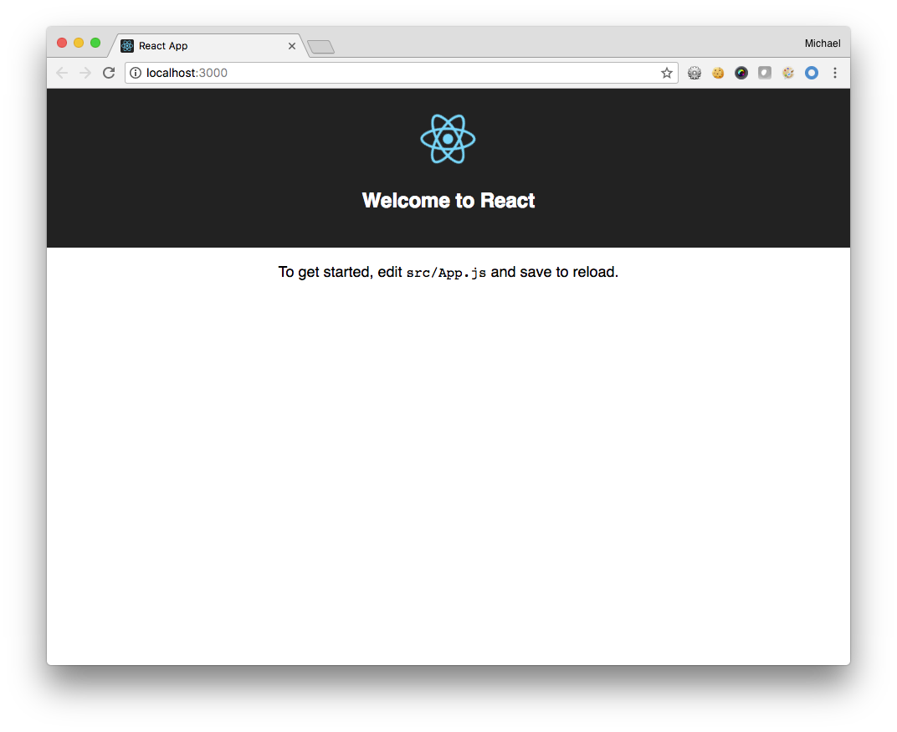

# React Powered Achievers API App tutorial

This tutorial will guide you through the process of creating a JS App powered by React.

## Prerequisites

Before you start, you must download and install the following: 
- NodeJS: https://nodejs.org/en/download/
- Yarn: https://yarnpkg.com/en/docs/install

This tutorial was written with npm v6.1.0 and Yarn v1.7.0.

We're going to start by following the steps listed on the official [ReactJS documentaion]( https://reactjs.org/docs/add-react-to-a-new-app.html) for creating a new React App. Execute the following on the command line:

```
npx create-react-app achievers-api-tutorial
cd achievers-api-tutorial
```

and then enter `npm start` or `yarn start`. Going forward, we will refer to this step as executing `yarn start` but the two are interchangable.

On your local machine, http://localhost:3000/, you should see the following:



Continue to step 2.
