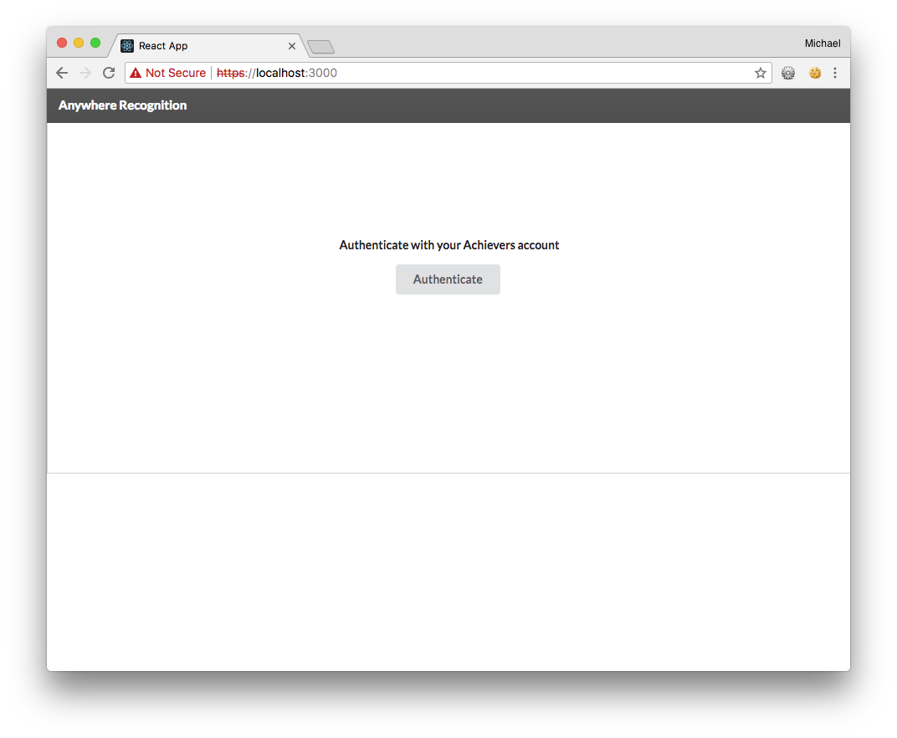

# React Powered Achievers API App tutorial

Now that you have added packages and a `.env` file, you can start building the login form.

Create two news files in the `src` directory and name them `Login.js` and `Login.css`. Since the React starter project uses [Webpack](https://webpack.js.org/), you can utilize the functionality to express that a JavaScript file depends on a CSS file. To create the relationship between the two files, you have to `import` the CSS file in your JavaScript file. Add the following to the two files:

###### src/Login.js
``` 
import React, { Component } from 'react';
import { Header, Button, Segment } from 'semantic-ui-react'
import './Login.css';

class Login extends Component {
  render() {
    return (
      <div className="login">
        <Header as="h4" attached="top" inverted>Anywhere Recognition</Header>
        <Segment attached>
          <div className="login-content">
            <Header as="h5">Authenticate with your Achievers account</Header>
            <Button>
              Authenticate
            </Button>
          </div>
        </Segment>
      </div>
    );
  }
}
  
export default Login;
```

###### src/Login.css
``` 
.login-content {
  width: 100%;
  height: 390px;
  text-align: center;
  padding-top: 125px;
}

.ui.attached.segment {
  margin-left: 0 !important;
  margin-right: 0 !important;
}
```

Make the following changes to `App.js`:

Near the top of `App.js` file, make the following changes to the `import` statement section.

```diff
-import logo from './logo.svg';
+import Login from './Login';
```

and update the `render()` function to the following:

```diff
  render() {
-    return (
-      <div className="App">
-        <header className="App-header">
-          
-          <h1 className="App-title">Welcome to React</h1>
-        </header>
-        <p className="App-intro">
-          To get started, edit <code>src/App.js</code> and save to reload.
-        </p>
-      </div>
-    );
+    return <Login />;
  }
```

In your browser, you will now see something like the following:



Right now, clicking on the button will not do anything. The next step is to get the button working. 

# Adding the button click

At the top of `Login.js` add the following `import` statement:
```diff
+import buildUrl from 'build-url';
```

In the `render()` function, change the following:

```diff
-            <Button>
+            <Button onClick={this.onLoginClick}>
```

Finally, add a `constructor` and a method named `onLoginClick`:

```diff
+  constructor(props) {
+    super(props);

+    this.onLoginClick = this.onLoginClick.bind(this);
+  }
  
+  onLoginClick() {
+    const loginDomain = process.env.REACT_APP_API_DOMAIN;
+    const clientID = process.env.REACT_APP_CLIENT_ID;

+    const authParams = {
+      response_type: 'token',
+      client_id: clientID,
+      scope: ['read write'],
+      state: Math.random(),
+      nonce: 'test',
+    }

+    const loginUrl = buildUrl(loginDomain, {
+      path: '/oauth/v2/openIDConnectClient/authorize',
+      queryParams: authParams,
+    });

+    console.log('loginUrl: ' + loginUrl);

+    window.open(loginUrl, 'Login to Achievers', 'width=900,height=700');
+  }
```

At this point, clicking on the "Authenticate" button will open a login window, so you can restart your development server. Instead of using `yarn start` you will use `HTTPS=true yarn start` to establish a secure connection over HTTPS. After logging in to your Achievers account, you will be prompted to authorize your App. After authorizing, the URL in your login window will have additional information in it. It will look something like the following:

`https://localhost:3000/#access_token=bba6732a3861f168775f3a7adc28e775d4bb9fbb&expires_in=1209600&token_type=bearer&scope=read&state=0.5060996102602306`

Save this access token to use for your other requests.

Continue to step 4.
