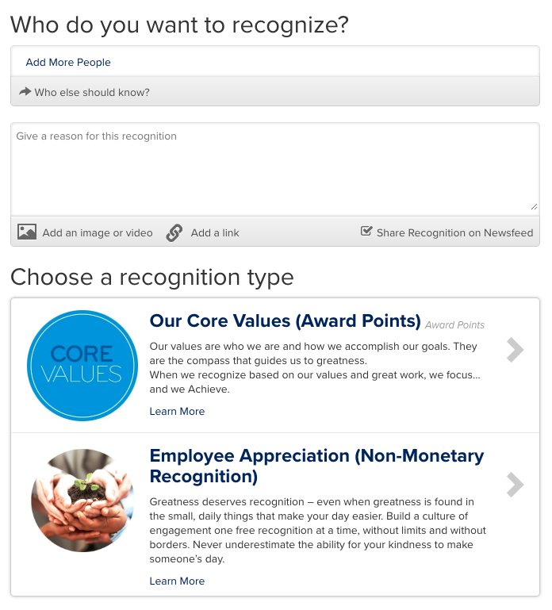

# React Powered Achievers API App tutorial

A typical recognition interface in the Achievers platform looks like the following:



Which can be divided into three sections:


The Who do you want to recognize section, is where the recipient(s) for the recognition are selected and listed. Additional users that should be notified are also managed here. The Give a reason for this recognition section is where the recognition reason is provided, along with additional content such as an image or external link. The Choose a Recognition type is where the recognition modules the current user has access to are listed. Once a module is selected, the recognition values are then displayed.  You will create components that mirror these three sections. It also makes sense to have a higher level component that can be used to tie these all together.

First, begin with the higher level or "main" component. In the `src` directory, create files named `Main.js` and `Main.css`. 

Add the following to the two files:

###### src/Main.js
``` 
import React, { Component } from 'react';
import { Button, Form } from 'semantic-ui-react'
import Recipients from './Recipients'
import Reason from './Reason'
import Modules from './Modules'
import './Main.css';

class Main extends Component {
  render() {
    return (
      <div className='anywhereRecognition'>
        <Form>
          <Recipients />
          <Reason />
          <Modules />
          <Button color='green' floated='right'>
            Post
          </Button>
        </Form>
      </div>
    )
  }
}

export default Main;
```

###### src/Main.css
``` 
.anywhereRecognition {
  padding: 10px;
}
```

This will result in compilation errors since the `Recipients`, `Reason` and `Modules` components do not yet exist. Rectify that by creating `Recipients.js`,`Recipients.css`, `Reason.js`, `Reason.css`, `Modules.js`, and `Modules.css` in the `src` directory.

###### src/Recipients.js
``` 
import React, { Component } from 'react';
import { Header, TextArea } from 'semantic-ui-react'
import './Recipients.css';

class Recipients extends Component {
  render() {
    return (
      <div className="recipients">
      <Header as="h2" content="Who do you want to recognize?" />
      <TextArea rows={2} placeholder="Type in the name of the person you'd like to recognize" />
      </div>
    );
  }
}
  
export default Recipients;
```

###### src/Recipients.css
``` 
.recipients {
}
```

###### src/Reason.js
``` 
import React, { Component } from 'react';
import { TextArea, Header } from 'semantic-ui-react'
import './Reason.css';

class Reason extends Component {
  render() {
    return (
      <div className="reason">
        <Header as="h2" content="Personalize your message" />
        <TextArea rows={5} placeholder='Give a reason for this recognition' />
      </div>
    );
  }
}
  
export default Reason;
```

###### src/Reason.css
```
.reason {
  
}
```

###### src/Modules.js
``` 
import React, { Component } from 'react';
import { Accordion} from 'semantic-ui-react'
import './Modules.css';

class Modules extends Component {
  return (
    <div className="modules">
      <Header as="h2" content="Choose a recognition type" />
    </div>
  )
}
  
export default Modules;
```

###### src/Modules.css
```
.modules {
  
}
```

Finally, make an adjustment to `App.js` to load the `Main` component if the `accessToken` is set. Since you are going to need the `accessToken`, pass it through as a prop.

At the top of `App.js` add the following `import` statement:

```diff
+import queryString from './Main';
```

and update the `render()` function to the following:

```diff
   render() {
+    if (accessToken) {
-      return <div>{accessToken}</div>;
+      return <Main accessToken={accessToken} />;
+    } 
```

After doing all of this, you should have something that looks like this:


Now we can work on populating the `Modules` component with data fetched from the API.

Continue to step 6.
