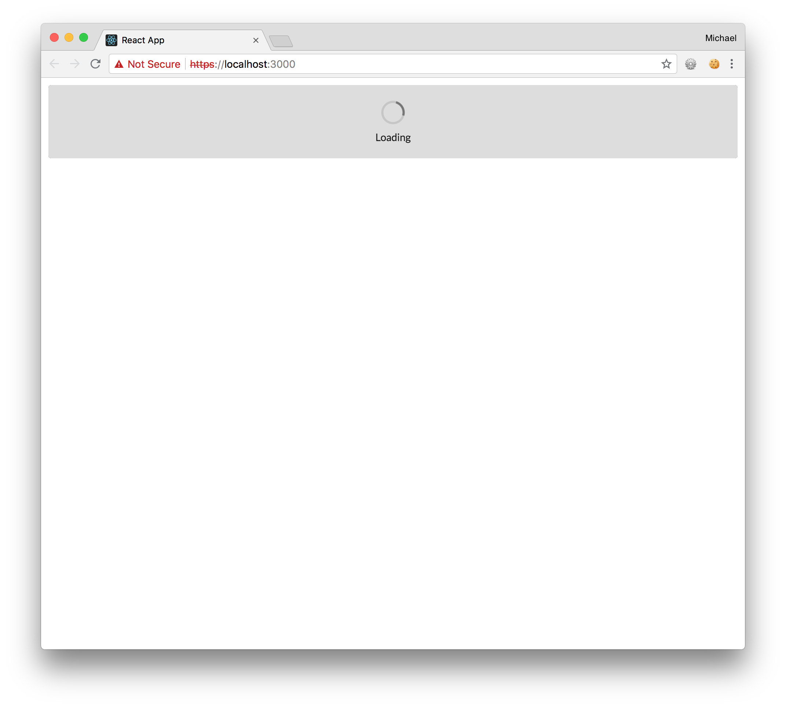
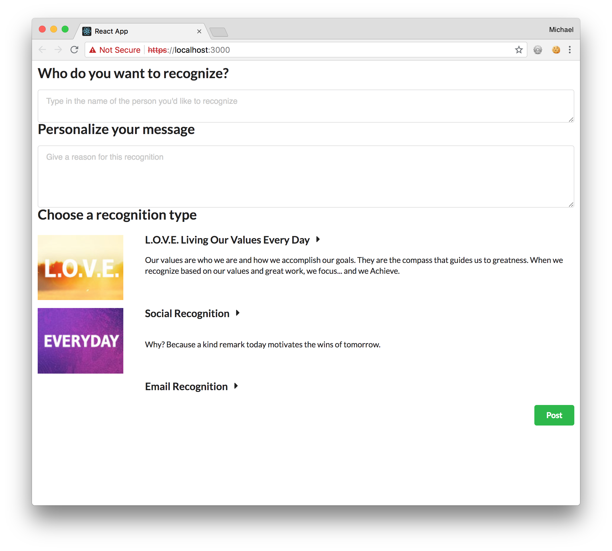

# React Powered Achievers API App tutorial

You can now make a request to the `/api/v5/recognitions` endpoint and display the results in the `Modules` component, using the [fetch() API](https://developer.mozilla.org/en-US/docs/Web/API/Fetch_API) provided by browsers. The starter app provides a polyfil `fetch()` so you do not have to worry about the browser support as [mentioned in the documentation for the starter App](https://github.com/facebook/create-react-app/blob/master/packages/react-scripts/template/README.md#fetching-data-with-ajax-requests).

To properly display the recognition interface you are going to retrieve the list of modules from an API response. While the list is being retrieved, a loading screen will be displayed, so you can work on that first.  You will manage this screen with a new state variable named `isLoadingModules` which you will work in to `Main.js`.

Add a constructor to `Main.js` that sets the `isLoadingModules` state:

###### src/Main.js
```diff
+  constructor(props) {
+    super(props);
+    this.state = {
+      isLoadingModules: true,
+    }
+  }
```  

And then update the `render()` method to examine this variable:

```diff
  render() {
+    const { isLoadingModules } = this.state;
+
+    if (isLoadingModules) {
+      return (
+        <div className='anywhereRecognition'>
+          <Segment inverted className='loader-segment'>
+            <Dimmer inverted active>
+              <Loader content='Loading' />
+            </Dimmer>
+          </Segment>
+        </div>
+      )
+    }
+
    return (
      <div className='anywhereRecognition'>
```

Update `Main.css` with the new style:

```diff
+.loader-segment {
+  height: 100px;
+}
```

Now your App should display a spinning loader:



Now you're going to add the function that will fetch the data from the API and and call it from a `componentDidMount()` that you will add to `Main.js`.

First, add the following file to the project: 


###### src/apiMethods.js
``` 
import buildUrl from 'build-url';

function fetchModules(accessToken) {
  const url = buildUrl(process.env.REACT_APP_API_DOMAIN, {
    path: '/api/v5/recognitions',
  });

  return fetch(url, {
      headers: {
        Authorization: `Bearer ${accessToken}`,
        'Content-Type': 'application/json',
      },
      credentials: 'same-origin',
      method: 'OPTIONS',
    }).then(res => {
      if (res.status >= 200 && res.status < 300) {
        return res;
      }
      const err = new Error(res.statusText);
      err.res = res;
      throw err;
    }).then(res => res.json());
}

export {
  fetchModules,
};
```

In `Main.js` add the following `import` statement and `componentDidMount()` method:

###### src/Main.js

```diff
+import { fetchModules } from './apiMethods';
```

```diff
+componentDidMount() {
+    const { accessToken } = this.props;
+    fetchModules(accessToken)
+      .then(res => {
+        this.setState({ modules: res.items, isLoadingModules: false });
+      })
+      .catch(err => {
+        this.setState({ error: err, isLoadingModules: false });
+      });
+  }
```

Notice that this method sets `isLoadingModules: false` when the modules have been retrieved. Now you need to pass the modules into the `Modules` component by making the following changes to the `render()` method of `Main.js`.

```diff
render() {
-    const { isLoadingModules } = this.state;  
+    const { isLoadingModules, modules } = this.state;

...snip...

    return (
      <div className='anywhereRecognition'>
        <Form>
          <Recipients />
          <Reason />
-          <Modules />
+          <Modules modules={modules} />
          <Button color='green' floated='right'>
```

Next, you'll update the `Module` component to use the new data in `modules` prop and introduce an [Accoridion](https://react.semantic-ui.com/modules/accordion) component from the Semantic UI React library for displaying the modules. You will also set up two functions -  one for looping over and rendering all of the modules, and another that loops over and renders all of the recognition values for each module. Make the following changes to `Modules.js`:

###### src/Modules.js

Update the imports as follows:

```diff
-import { Header } from 'semantic-ui-react'
+import { Accordion, Icon, Header, Image } from 'semantic-ui-react'
```

Update the render method as follows:

```diff
  render() {
+    const { modules } = this.props;
+    const moduleItems = modules.map((module, i) => this.RenderModule(module, i));

    return (
      <div className="modules">
        <Header as="h2" content="Choose a recognition type" />
+        <Accordion fluid>
+          {moduleItems}
+        </Accordion>
      </div>
    )
```

Add the `RenderModule()` and `RenderCriteria()` methods:

```
  RenderModule(module, i) {
    const { activeModuleIndex } = this.state;
    const criteriaItems = module.criteria.map((criterion, i) => this.RenderCriteria(criterion, i));

    return (
      <div key={module.id}>
        <Accordion.Title active={activeModuleIndex === i} index={i} onClick={this.handleModuleClick} className="module-wrapper">
        <div className="module-image">
          <Image src={module.bannerURL} size='small' /> 
        </div>
        <div className="module-info">
          <Header>
            {module.name} <Icon name='dropdown' />
          </Header>
          <div dangerouslySetInnerHTML={{__html: module.description}} />
        </div>
        </Accordion.Title>
        <Accordion.Content active={activeModuleIndex === i}>
          <Accordion fluid>
            {criteriaItems}
          </Accordion>
        </Accordion.Content>
      </div>
    )
  }

  RenderCriteria(criterion, j) {
    const { activeCriterionIndex } = this.state;

    return (
      <div key={criterion.id}>
        <Accordion.Title active={activeCriterionIndex === j} index={j} criteriaid={criterion.id} onClick={this.handleCriterionClick} content={criterion.name} />
        <Accordion.Content active={activeCriterionIndex === j}>
          <div className="criterion-wrapper">
            <div className="criterion-image">
              <Image src={criterion.criterionBannerUrl} size="small" /> 
            </div>
            <div className="criterion-info" dangerouslySetInnerHTML={{__html: criterion.description}} />
          </div>
        </Accordion.Content>
      </div>
    )
  }
```  

Along with code for handling the clicks:

```
  handleCriterionClick = (e, titleProps) => {
    const { index, criteriaid } = titleProps
    const { activeCriterionIndex } = this.state
    const newIndex = activeCriterionIndex === index ? -1 : index
    this.setState({ activeCriterionIndex: newIndex })
  }

  handleModuleClick = (e, titleProps) => {
    const { index } = titleProps
    const { activeModuleIndex } = this.state
    const newIndex = activeModuleIndex === index ? -1 : index

    this.setState({ activeModuleIndex: newIndex, activeCriterionIndex: -1 })
  }
```

Add a constructor to set appropriate defaults:

```
  constructor(props) {
    super(props);
    this.state = {
      activeModuleIndex: -1,
      activeCriterionIndex: -1,
    }
  } 
```

Add the following to the `Modules.css` file:

###### src/Modules.css

```
.module-wrapper {
  padding: 10px;
  display: flex;
}

.criterion-wrapper {
  padding: 10px;
  display: flex !important;
}

.module-image {
  flex-grow: 0;
  flex-shrink: 0;
  flex-basis: 20%;
  margin-left: 0px;
}

.criterion-image {
  flex-grow: 0;
  flex-shrink: 0;
  flex-basis: 20%;
  margin-left: 20px;
}
```

If you look at your app in a browser now it might look something like this:



You can click on the modules to expland them and display the list of recognition values. You may see an "Email Recognition" module that isn't normally usable but which, at the time of writing this, is returned by the `OPTIONS` request. Dealing with points-based recognition modules can be complex and is beyond the scope of this tutorial. To exclude points-based and Email modules, you will make a change to the `fetchModules()` method in `apiMethods.js`.

```diff
-      throw err;
-    }).then(res => res.json());
+    }).then(res => res.json())
+    .then(res => {
+      res.items = res.items.filter(item => item.moduleType === 'FREE' && !item.name.includes('Email'));
+      return res;
+    });
}
```


With the modules and recognition values now rendering, you can focus on updating the `Recipients` component so it can fetch users from the Achievers API.

Continue to step 7.

