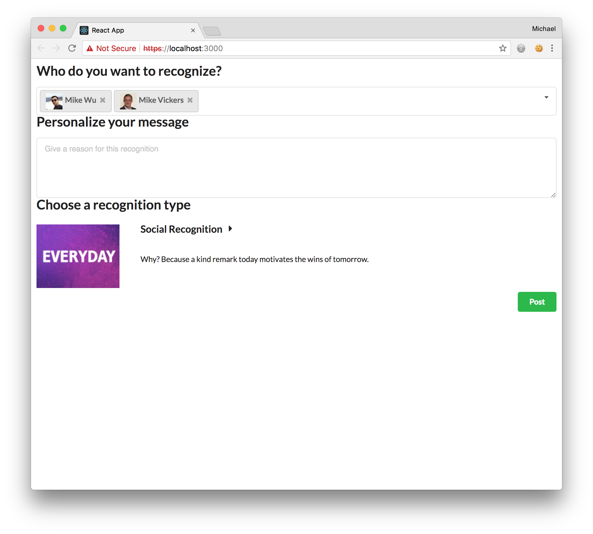

# React Powered Achievers API App tutorial

This step will focus on getting the user search working with the Achievers API user endpoint. We're going to use the [Accoridion](https://react.semantic-ui.com/modules/dropdown) component from the Semantic UI React library for rendering the user search.

First, we'll create a new method that uses the `fetch()` method we used earlier that access the Achievers user endpoint in our `apiMethods.js` file.

###### src/apiMethods.js

Add the following method:

```
function doUserSearch(accessToken, q = '') {
  const url = buildUrl(process.env.REACT_APP_API_DOMAIN, {
    path: '/api/v5/users',
    queryParams: { q },
  });

  return fetch(url, {
    headers: {
      Authorization: `Bearer ${accessToken}`,
      'Content-Type': 'application/json',
    },
    credentials: 'same-origin',
  }).then(res => {
    if (res.status >= 200 && res.status < 300) {
      return res;
    }

    const err = new Error(res.statusText);
    err.res = res;
    throw err;
  }).then(res => res.json());
}
```

and update the export section as follows:

```diff
export {
  fetchModules,
+  doUserSearch,
};
```

Back in our `Main` component we're going to need to pass along the `accessToken` so the `Recipients` component can use it as an argument to `doUserSearch()` so let's update the `render()` method of `Main.js` now as well.

###### src/Main.js

```diff
    return (
      <div className='anywhereRecognition'>
        <Form>
-          <Recipients />
+          <Recipients accessToken={accessToken} />
          <Reason />
```

Now we'll update the `Recipients` component itself. We'll swap out the `TextArea` component we added as a placeholder before with a `Dropdown` component. As we're going to need to manipulate arrays a lot we're going to utilize the [Lodash](https://lodash.com/) library. The react starter app already utilizes it so all we need to do is import it.


###### src/Recipients.js

At the top of the file make the following changes to the `import` statements:

```diff
-import { Header, TextArea } from 'semantic-ui-react'
+import { Header, Dropdown } from 'semantic-ui-react'
+import _ from 'lodash';
+import { doUserSearch } from './apiMethods'; 
```

Update the `render()` method like so:

```diff
   render() {
+    const renderLabel = label => ({
+      content: label.text,
+      image: label.image,
+    })
+
+    const { isFetching, options } = this.state
+
     return (
       <div className="recipients">
       <Header as="h2" content="Who do you want to recognize?" />
-      <TextArea rows={2} placeholder="Type in the name of the person you'd like to recognize" />
+        <Dropdown
+          fluid
+          selection
+          multiple
+          search
+          selection
+          closeOnChange
+          options={options}
+          placeholder='Add more people'
+          onSearchChange={this.handleSearchChange}
+          disabled={isFetching}
+          loading={isFetching}
+          renderLabel={renderLabel} 
+          onChange={this.handleRecipientsChange} />
       </div>
     );
   }
```

and add a `componentWillMount()` method that will set the initial state in a sensible way:

```
  componentWillMount() {
    this.setState({
      isFetching: false,
      multiple: true,
      search: true,
      searchQuery: '',
      value: [],
      options: [],
    })
  }
```

along with the two methods referenced by the `Dropdown` component, `handleRecipientsChange()` and `handleSearchChange`:

```
  handleRecipientsChange(e, { value }) {
    this.setState({ value });
  }

  handleSearchChange = (e, { searchQuery }) => {
    const { accessToken } = this.props

    this.setState({ isFetching: true })

    doUserSearch(accessToken, searchQuery)
      .then(res => {
        const users = res.items.map((user) => { 
          return { key: user.id, text: user.fullName , image: { src: user.profileImageUrl }, value: user.id } 
        });

        this.setState((prev, props) => {
          const newOptions = _.uniqBy(users.concat(prev.options), 'key');
          return { isFetching: false, options: newOptions };
        });
      })
      .catch(err => {
        this.setState({ error: err, isLoading: false });
      });
  }
```  

Finally, add some css to `Recipients.css` so the dropdown looks the way we want it to:

###### src/Recipients.css

```
.recipients .ui.image {
  display: inline;
  margin-right: 4px;
}
```

With all of this added you should have a dropdown that looks something like this:



With this done, we can move on to step 8.