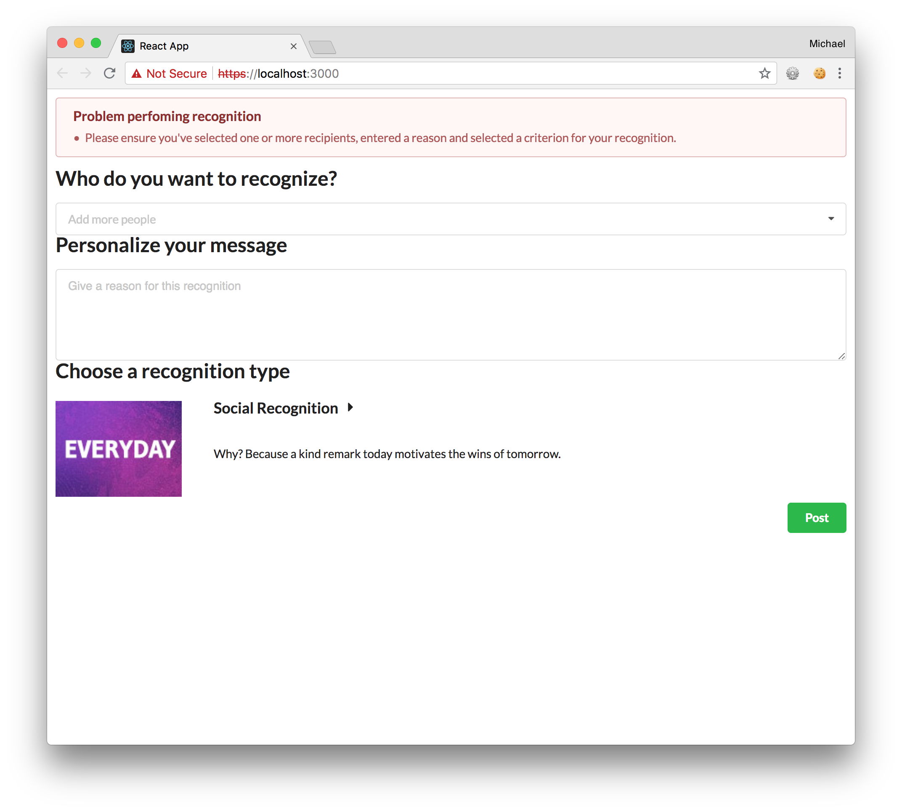
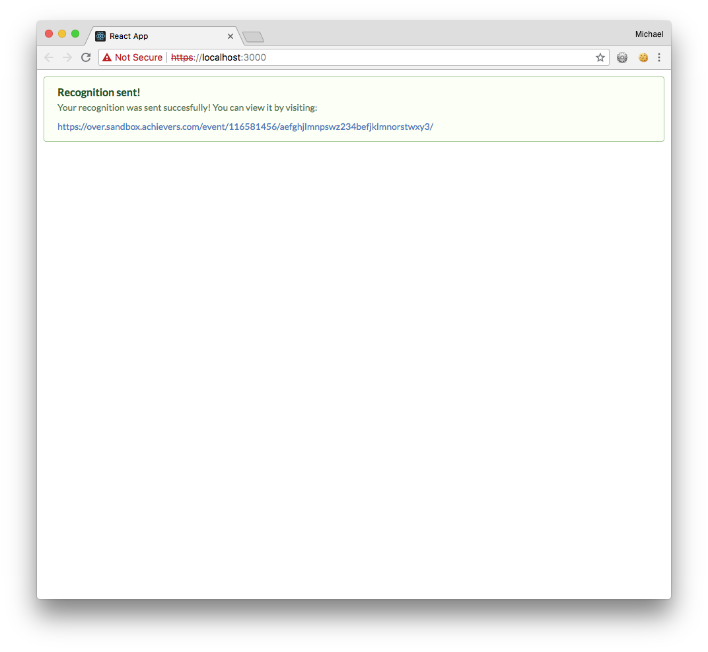

# React Powered Achievers API App tutorial

Now that we have access to all of the data from our components we can use the data to do a request to the Achievers API that will create a recognition in the Achievers platform.

Let's create a method in `apiMethods.js` that will do the necessary `POST` reqeust.

###### src/apiMethods.js

Add a new `import` statement at the top of the file:

```diff
import buildUrl from 'build-url';
+import queryString from 'query-string';
```

Add the definition for the `postRecognition()`:

```
function postRecognition(accessToken, nominees, recognitionText, criterionId) {
  const url = buildUrl(process.env.REACT_APP_API_DOMAIN, {
    path: '/api/v5/recognitions',
  });

  return fetch(url, {
    headers: {
      Authorization: `Bearer ${accessToken}`,
      'Content-Type': 'application/x-www-form-urlencoded; charset=UTF-8',
    },
    credentials: 'same-origin',
    method: 'POST',
    body: queryString.stringify({
      nominees: nominees,
      recognitionText,
      criterionId,
      useUserIds: true,
    }),
  }).then(res => {
    if (res.status >= 200 && res.status < 300) {
      return res;
    }

    const err = new Error(res.statusText);
    err.res = res;
    throw err;
  }).then(res => res.json());
}
```

and finally the necessary `export`

```diff
export {
  fetchModules,
  doUserSearch,
+  postRecognitions,
};
```

Now we can go back to our `Main` component and add in the finishing touches.

###### src/Main.js

At the top, let's add some new `import` statements. The `Message` and Lodash imports are for doing some basic validation before we attempt to make a request to the Achievers API:

```diff
-import { Button, Form, Segment, Dimmer, Loader } from 'semantic-ui-react'
+import { Button, Form, Segment, Dimmer, Loader, Message } from 'semantic-ui-react'
 import Recipients from './Recipients'
 import Reason from './Reason'
 import Modules from './Modules'
+import _ from 'lodash';
+import { fetchModules, postRecognition } from './apiMethods';
```

Update the `handleSubmit()` method that gets called when a user clicks the "Post" button with some basic error checking and a call to the `postRecognition()` method:

```diff
   handleSubmit = (event) => {
     const { accessToken } = this.props;
     const { reason, recipients, criterionId } = this.state;
-    console.log('reason: ' + reason + ' recipients: ' + recipients + ' criterionId: ' + criterionId);
+
+    if (!accessToken || !recipients || !reason || !criterionId) {
+      const errors = ['Please ensure you\'ve selected one or more recipients, entered a reason and selected a criterion for your recognition.'];
+      this.setState({errors: errors});
+    } else {
+        // will fill in soon
+    }
+    
     event.preventDefault();
   }
```

and make some adjustments so we can display an error message:

```diff
   render() {
     const { accessToken } = this.props;
-    const { isLoadingModules, modules } = this.state;
+    const { isLoadingModules, modules, errors } = this.state;
 
     if (isLoadingModules) {
       return (
...snip...
    return (
      <div className='anywhereRecognition'>
+        <Message error header='Problem perfoming recognition' hidden={_.isEmpty(errors)} list={errors} />
        <Form onSubmit={this.handleSubmit}>
          <Recipients accessToken={accessToken} onRecipientsChange={this.handleRecipientsChange} />
          <Reason onReasonChange={this.handleReasonChange} />
```

and finally, update the contructor so it sets a detault state for `errors`:

```diff
  constructor(props) {
    super(props);
    this.handleReasonChange = this.handleReasonChange.bind(this);
    this.handleModuleCriterionChange = this.handleModuleCriterionChange.bind(this);
    this.handleRecipientsChange = this.handleRecipientsChange.bind(this);

    this.state = {
      isLoadingModules: true,
+      errors: [],
    }
  }
```

With all of this in place you should see the following if you try to submit an incomplete form.



For the case where a completed form is submitted, we want to display a success message along with the ability to view the recognition within the Achievers Platform. In order to achieve this we need to add a few things to the `Main` component.

###### src/Main.js

First set a new state variable in the constructor:

```diff
  constructor(props) {
    super(props);
    this.handleReasonChange = this.handleReasonChange.bind(this);
    this.handleModuleCriterionChange = this.handleModuleCriterionChange.bind(this);
    this.handleRecipientsChange = this.handleRecipientsChange.bind(this);

    this.state = {
      isLoadingModules: true,
+      isDoneSuccessfullySendingRecognition: false,
      errors: [],
    }
```

```diff
  handleSubmit = (event) => {
    const { accessToken } = this.props;
    const { reason, recipients, criterionId } = this.state;

    if (!accessToken || !recipients || !reason || !criterionId) {
      const errors = ['Please ensure you\'ve selected one or more recipients, entered a reason and selected a criterion for your recognition.'];
      this.setState({errors: errors});
    } else {
-        // will fill in soon      
+      postRecognition(accessToken, recipients, reason, criterionId)
+        .then(res => {
+          this.setState({ errors: [], newsfeedEventURL: res.newsfeedEventURL , isDoneSuccessfullySendingRecognition: true });
+        })
+        .catch(err => {
+          this.setState({ error: err });
+        });
    }
    event.preventDefault();
  }
```

and finally update the render method to use this new information:

```diff
   render() {
     const { accessToken } = this.props;
-    const { isLoadingModules, modules, errors } = this.state;
+    const { isLoadingModules, isDoneSuccessfullySendingRecognition, newsfeedEventURL, modules, errors } = this.state;
+
+    if (isDoneSuccessfullySendingRecognition) {
+      return (
+        <div className='anywhereRecognition'>
+        <Message inverted positive>
+          <Message.Header>Recognition sent!</Message.Header>
+          <p>Your recognition was sent succesfully! You can view it by visiting:</p>
+          <a href={newsfeedEventURL} target='_blank'>{newsfeedEventURL}</a>
+        </Message>
+        </div>
+      )
+    }
```

Filling in the form properly should now result in something like the following:



Congratulations! You now have a working Achievers API integration that allows you to create recognitions within the Achievers Platform!
